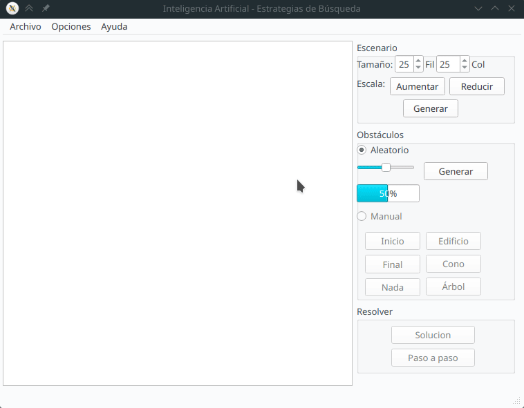

# Qt5-AStarPathfinding

Pathfinding in Qt5 using A* search algorithm for the subject *Inteligencia Artificial* at [Universidad de La Laguna](https://www.ull.es).

## Requirements

- [Qt](https://qt.io)

The source code can be found under [IA](IA/) directory. It has been tested on Qt 4.8, Qt 5.15 and Qt 6.5 under GNU/Linux.

## Useful Links

- [Qt](https://www.qt.io)
- [Qt Docs](https://doc.qt.io)
- [A* search algorithm](https://en.wikipedia.org/wiki/A*_search_algorithm)
- [Computer Science at Universidad de La Laguna](https://www.ull.es/grados/ingenieria-informatica)

## License

This project is licensed under the [GPL v2 license](LICENSE).
